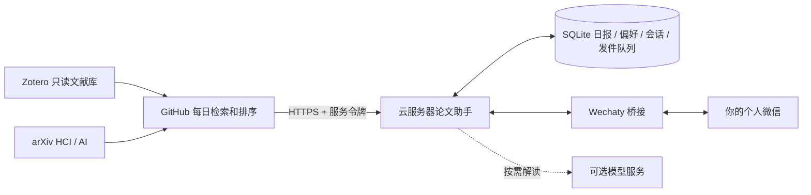

# HCI / AI 微信论文助手

在上游的“Zotero → 新论文 → 相似度排序”基础上，增加持久日报、问答服务和个人微信桥接。默认订阅 cs.HC、cs.AI、cs.LG、cs.CL、cs.CV，纳入交叉分类，每期最多 10 篇。

## 实现思路

1. **收集与排序**：GitHub Actions 检索新论文，用 Zotero 文献摘要做相似度排序。排序模型在 Actions 本地运行，不需要模型 API。默认关闭全文下载。
2. **稳定引用**：服务把每份日报保存为不可变快照，日期加内容摘要构成日报编号。相同内容重试不会重复入队；同一天内容改变则产生另一个版本，不改变旧编号。
3. **持续对话**：云服务器保存会话和偏好；“它”“这篇”沿用上次选择的论文。收到新一期日报后切到新一期；也可以指定旧日报编号。
4. **收发通道**：独立 Wechaty 桥接进程，只处理指定用户发来的私聊文字，只给这个用户发消息。不处理群聊，不自动加好友。
5. **模型可选**：无模型时能看日报、原始摘要、链接和修改偏好。解读、比较和研究启发需另外接入兼容 Chat Completions 的模型服务。



## 当前边界

- **代码和模拟测试不等于真实微信已登录。** 个人微信采用第三方 Wechaty Puppet Service，不是腾讯提供的通用个人聊天 API。需要实际可用的供应商服务及 token；可用性和服务条件须在部署时核验，项目不附送该服务。
- 桥接区分机器人登录账号与接收日报的个人微信账号。你从接收账号给机器人发消息；机器人自身发送的消息会被忽略以防循环。只有一个账号时不能直接按此设计完成双向聊天。
- 无模型时不生成中文翻译、总结或比较。没有全文时，回答依据仅限摘要，不能据此确认未提供的实验细节。
- 暂未实现搜索整个 Zotero 库进行问答、自动写入 Zotero、任意自然语言修改配置。Zotero 仅用于上游个性化排序。
- 本服务为单用户单进程设计，启动一个 worker。SQLite 目录需持久化并备份。
- 发件队列采用“至少一次”交付：成功发送后才确认。如果微信已收到而进程在确认前崩溃，重试可能重复发送；不承诺严格恰好一次。
- GitHub 每天北京时间 06:00 计划触发，实际可能延迟；无新论文默认不推送。

## Zotero 用户 ID 与只读密钥

1. 登录 <https://www.zotero.org/settings/keys>。如页面重定向，进入 Settings 的 API Keys 页面。
2. 找到 **Your userID for use in API calls is …** 一类提示，复制数字。这是 `ZOTERO_ID`，不是用户名、邮箱或条目的 key。
3. 选择 **Create new private key**，名称例如 `HCI paper assistant`。
4. **Personal Library** 下只勾选 **Allow library access**。
5. **不要勾选 Allow write access**。本版不需要笔记和文件读取权限，相关权限保持关闭；群组库权限也保持关闭，当前上游读取个人库。
6. 保存后复制密钥，填入 GitHub Repository Secret **ZOTERO_KEY**；数字 ID 填入 **ZOTERO_ID**。
7. Zotero 桌面端先完成元数据同步，个人库需要有带摘要的期刊文章、会议论文或预印本，才能做个性化排序。

不要把密钥写入公开仓库、CUSTOM_CONFIG 或聊天。官方说明：<https://www.zotero.org/support/dev/web_api/v3/basics>。

## 无密钥离线演示

在仓库根目录，使用 Python 3.13+：

```sh
PYTHONPATH=src python -m zotero_arxiv_daily.assistant.demo
PYTHONPATH=src python -m zotero_arxiv_daily.assistant.demo --interactive
```

演示使用明确标注的虚构论文，不访问 Zotero、微信或模型，也不改真实偏好。

## 云服务器部署

准备 Docker Compose 和可供 GitHub 访问的 HTTPS 域名。开始时可以仅运行核心服务，无需微信或模型 token。

```sh
git clone --branch feature/paper-assistant https://github.com/WANYiran/zotero-arxiv-daily.git
cd zotero-arxiv-daily
cp deploy/.env.example deploy/.env
python -c 'import secrets; print(secrets.token_urlsafe(32))'
```

将生成值填入 `deploy/.env` 的 `ASSISTANT_TOKEN`；这份文件只放在服务器上。模型三项暂时留空。

```sh
docker compose -f deploy/compose.yaml up -d --build assistant
curl http://127.0.0.1:8080/health
```

返回 `{"status":"ok","model_enabled":false}` 表示核心已启动，不代表微信已连接。Compose 仅绑定服务器本机端口，需用现有 Nginx/Caddy 等反向代理将 HTTPS 转发至 `127.0.0.1:8080`。不要将无 TLS 端口直接开放给 GitHub。

除 `/health` 外，接口都要求 `Authorization: Bearer <ASSISTANT_TOKEN>`：

| 接口 | 用途 |
| --- | --- |
| `POST /digests` | `{date, papers, deliver}`，持久保存日报并排队 |
| `POST /chat` | `{message_id, text, deliver}`，重复 ID/问题幂等，不同问题复用 ID 返回 409 |
| `GET /preferences` | 获取后续日报排序偏好 |
| `POST /outbox/claim` | 领取一个有 120 秒租约的消息片段 |
| `POST /outbox/ack` | `{id, lease_token}`，成功发送后确认 |

聊天默认 `deliver:false` 仅返回结果，微信桥接设为 `true` 将回复排队。日报默认 `deliver:true`。单篇上传正文最多 16000 字符，总请求限制 2 MB；一次问答最多选择 3 篇。

### 连接个人微信

使用 Wechaty SDK 1.20.2 / Puppet Service 1.18.2，接口已对照安装包声明检查。服务参考：<https://wechaty.js.org/docs/puppet-services/>。文档列出的服务不保证当前都能购买或登录。

取得并验证服务 token 后，在 `.env` 填入 `WECHATY_PUPPET_SERVICE_TOKEN`。先运行识别模式，用**接收日报的账号**给机器人登录账号发一句话：

```sh
docker compose -f deploy/compose.yaml --profile wechat run --rm --build bridge node index.mjs --identify
```

扫描终端二维码登录机器人账号；识别模式只打印私聊发送者 ID，不回复。将自己的 ID 填入 `WECHAT_OWNER_ID`，退出识别进程，再正常启动：

```sh
docker compose -f deploy/compose.yaml --profile wechat up -d --build
```

这一步需真实账号验证，目前未自动执行。更换桥接供应商不必改写问答服务和 Zotero 配置。

### 可选模型

在服务器 `.env` 填 `ASSISTANT_LLM_KEY`、`ASSISTANT_LLM_BASE`、`ASSISTANT_MODEL`，重新创建 assistant 容器。密钥只用于按需问答，不放入每日检索任务；默认每日仍不调用模型。

问答服务不会自动补抓全文。如需要全文证据，将 `config/hci_assistant.yaml` 的 `fetch_full_text` 改为 `true`，后续日报会存最多 16000 字符的提取文本。下载耗时会增加，回答依据仍称为“全文节选”。

## 开启 GitHub 每日任务

新增 `.github/workflows/paper-assistant.yml` 只有在变量 `ASSISTANT_ENABLED=true` 时执行。**先完成服务和微信实测，再开启。** 功能分支合并到默认分支后，计划触发才生效。

仓库 Settings → Secrets and variables → Actions：

| 类型 | 名称 | 内容 |
| --- | --- | --- |
| Secret | `ZOTERO_ID` | Zotero 数字用户 ID |
| Secret | `ZOTERO_KEY` | Zotero 只读密钥 |
| Secret | `ASSISTANT_URL` | 你的 HTTPS 服务根地址 |
| Secret | `ASSISTANT_TOKEN` | 与服务器一致的随机令牌 |
| Variable | `ASSISTANT_ENABLED` | 完成配置和验收后设为 `true` |

手动运行 **HCI AI paper assistant**，确认“日报保存→微信收到→回复第3篇→收到资料”，再等待每日任务。助手模式开启后，原邮件定时任务会跳过，避免双重运行。

## 可用对话

| 消息 | 行为 |
| --- | --- |
| 日报 / 今天日报 / 昨天日报 | 查看日报并切换上下文 |
| 2026-09-17 日报 | 查看指定日期的最新版 |
| 第3篇 / 第三篇 | 无模型返回摘要，有模型解释论文 |
| 第3篇原始摘要 | 无论模型是否可用都显示原始摘要 |
| 第3篇链接 | 原文和 PDF 链接 |
| 比较第2篇和第5篇 | 模型比较，或无模型时列出摘要 |
| 它的实验怎么做的？ | 继续上次选中的论文，证据不足明确说明 |
| 关注 AI Agent / 减少 benchmark | 保存一个关键词，调整后续排序 |
| 取消关注 AI Agent / 取消减少 benchmark | 移除关键词 |
| 偏好 / 帮助 | 查看偏好或命令 |

可用“日报编号 2026-09-17-xxxxxxxxxxxx 第3篇”精确指定旧版本。偏好一次一个关键词，不自动翻译或理解复杂筛选表达式；对英文摘要建议使用英文词。论文内容中的指令不应被执行；模型回答不会触发 Zotero 写入。

## 验证与维护

```sh
uv run pytest
cd bridge
npm ci
npm test
```

测试覆盖原有功能回归，以及跨天/同日编号稳定、上下文、只读边界、禁用模型、偏好排序、认证、请求大小、并发去重、发送租约和微信允许列表。

上线前仍需验证服务器部署、微信服务可登录性、真实 Zotero 读取、模型质量（如开启）、消息收发。安装开发时没有读取或发送你的微信消息。

备份 `assistant-data` 和 `wechat-session` 卷；后者含登录会话，应私密保存。数据库保留日报和对话，需按个人保留周期维护。本版没有多用户隔离、动态扩缩容或管理员后台。
